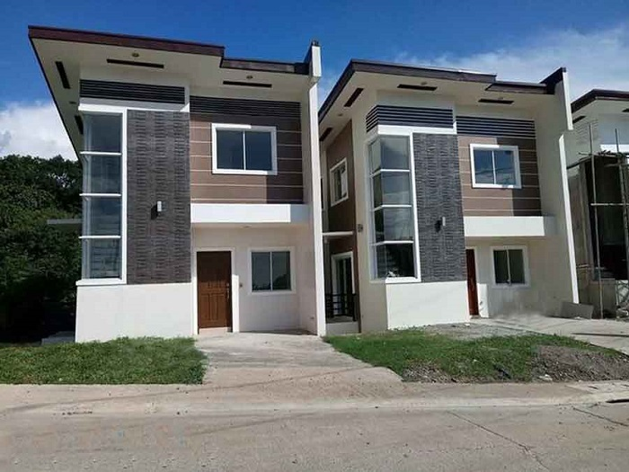
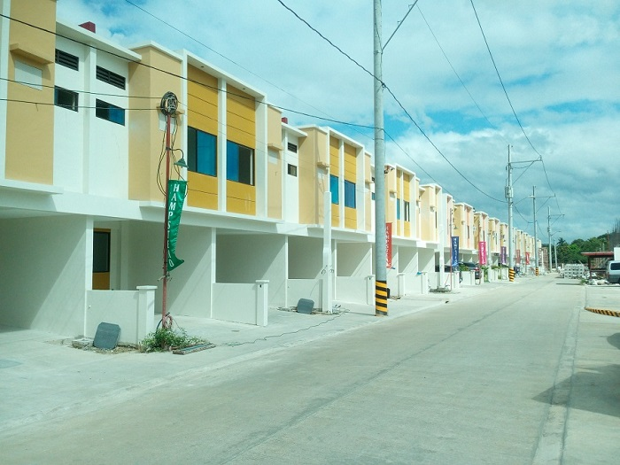
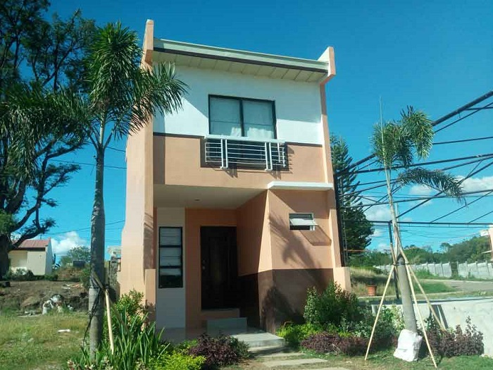
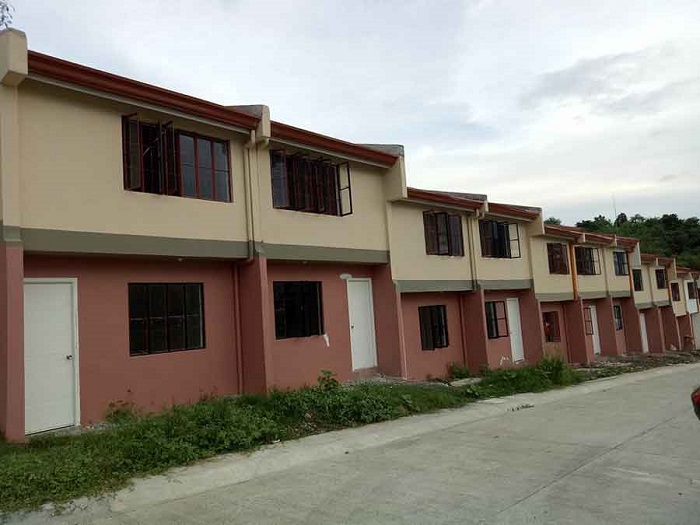
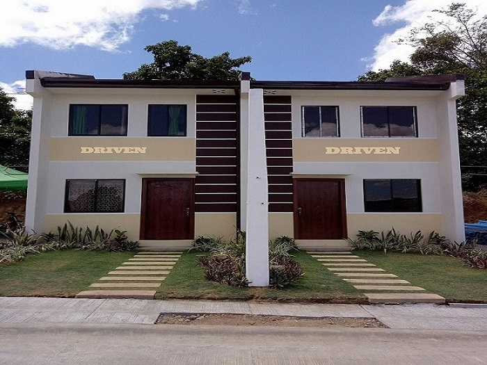

<!-- Section -->
<section>
	<header class="major">
		<h2>Types of Unit Turnover</h2>
	</header>
	

		<article>
			
			

				<h3>Bare Type</h3>
				
This type of turnover is just the basic. No tiles, paint, ceiling and room partitions.

			

		</article>
		<article>
			
			

				<h3>Semi Finished</h3>
				
When turned over to buyer this type usually has no tiles but with single coating paint. Room are partitioned with celing. 

			

		</article>
		<article>
			
			

				<h3>Complete Finished</h3>
				
For property priced 3M up, developers offers it complete finished. Tiled floors, vinyled 2nd floor with partitions and built in cabinets upon handover.

			

		</article>
		<article>
			
			

				<h3>Fully Furnished</h3>
				
Complete finished with furnitures. Some model units ended up as fully finished.

			

		</article>
	

</section>

<!-- Section -->
<section>
	<header class="major">
		<h2>Featured</h2>
	</header>
	

		<article>
			
			<h3>Buyers Guide</h3>
			
Buying a property is a daunting task. Unlike buying a gadget or vehicle, properties will either be your home or investment. Here's a short article to keep you guided for your purchase.

			<ul class="actions">
				<li><a href="article/2014/08/07/first-post.html" class="button">More</a></li>
			</ul>
		</article>
		<article>
			
			<h3>Zuri Residences</h3>
			
Discover a new residential haven so private, green and delightfully different. This can be your secret get-away from the hustle and bustle of work in Metro Manila. Very good location and features perfect view. Experience a getaway from Metropolis without going too far.

			<ul class="actions">
				<li><a href="taytay/2018/05/08/zuriIzumi.html" class="button">More</a></li>
			</ul>
		</article>
		<article>
			
			<h3>Hamsptead Place</h3>
			
Hampstead Place Marikina is located in Brgy. Nangka Marikina City, near in San Mateo Rizal, and accessible to Quezon City and Makati. It's is a new development project, and very accessible to Public Transport like: Jeepneys, Uv Express, Taxi, and Bus. Routes of Public Transportation are, going to Cubao, Commonwealth Quezon City to Sta Lucia East Mall (part of Cainta, Rizal)

			<ul class="actions">
				<li><a href="marikina/2018/03/14/hampstead.html" class="button">More</a></li>
			</ul>
		</article>
		<article>
			
			<h3>Bria Baras Bettina</h3>
			
Perhaps the most affordable project you can find in Rizal. It offers affordable homes without sacrificing quality. This new subdivision is very accessible via Marcos Highway.

			<ul class="actions">
				<li><a href="baras/2018/05/03/BriaBarasBettina.html" class="button">More</a></li>
			</ul>
		</article>
		<article>
			
			<h3>Bloomfield East</h3>
			
Bloomfield East is located in Mahabang Parang, at the boundary of Antipolo and Angono.   Just 300 meters from M. L. Quezon Ave., project is accessible through public transportation and is near commercial areas, schools, and hospitals.

			<ul class="actions">
				<li><a href="angono/2017/10/20/bloomfield-east-angono.html" class="button">More</a></li>
			</ul>
		</article>
		<article>
			
			<h3>Antipolo Residences</h3>
			
Looking for a property with a nice overlooking view? How about rural feel right inside the city? This will be the right one for you. One tricycle ride from Antipolo Cathedral and other major establishments. Major roads to access are Ortigas Ave ext., Sumulong Highway and Marcos Highway.

			<ul class="actions">
				<li><a href="antipolo/2018/04/18/res.html" class="button">More</a></li>
			</ul>
		</article>
	

</section>
